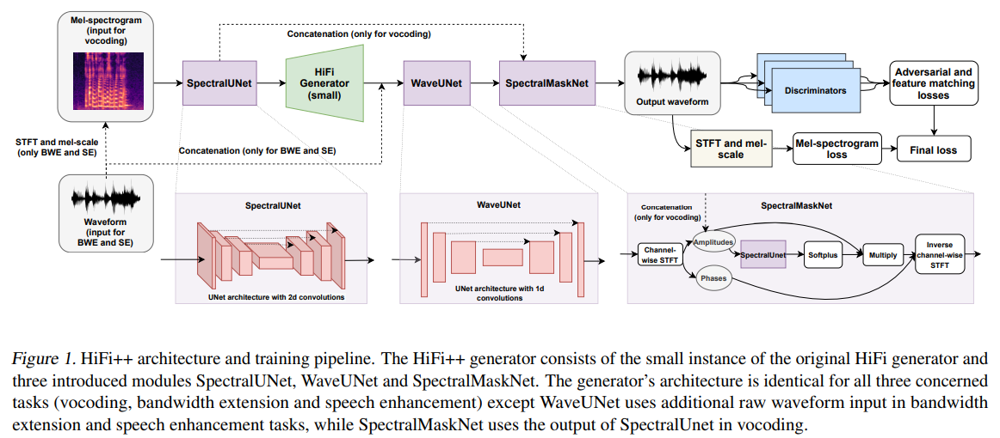

# HiFi++ : a Unified Framework for Neural Vocoding, Bandwidth Extension and Speech Enhancement
This is the unofficial implementation of Vocoder part of [HiFi++ : a Unified Framework for Neural Vocoding, Bandwidth Extension and Speech Enhancement](https://arxiv.org/abs/2203.13086).


* Currently, this repo is WIP but you can start your training without any error. 
## Training:
```
python train.py --config config_v2.json
```


## Citations:
```
@misc{https://doi.org/10.48550/arxiv.2203.13086,
  doi = {10.48550/ARXIV.2203.13086},
  
  url = {https://arxiv.org/abs/2203.13086},
  
  author = {Andreev, Pavel and Alanov, Aibek and Ivanov, Oleg and Vetrov, Dmitry},
  
  keywords = {Sound (cs.SD), Machine Learning (cs.LG), Audio and Speech Processing (eess.AS), FOS: Computer and information sciences, FOS: Computer and information sciences, FOS: Electrical engineering, electronic engineering, information engineering, FOS: Electrical engineering, electronic engineering, information engineering},
  
  title = {HiFi++: a Unified Framework for Neural Vocoding, Bandwidth Extension and Speech Enhancement},
  
  publisher = {arXiv},
  
  year = {2022},
  
  copyright = {arXiv.org perpetual, non-exclusive license}
}

```


## References:
* https://github.com/jik876/hifi-gan

